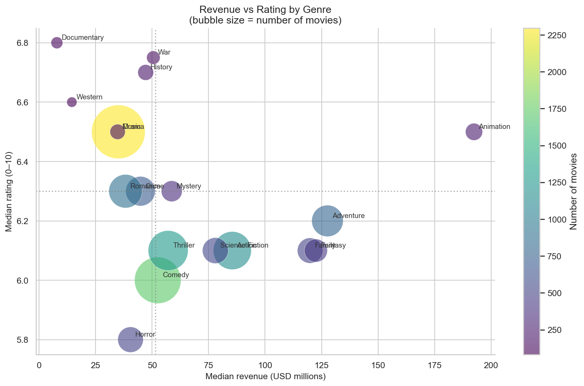
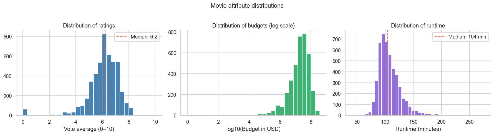
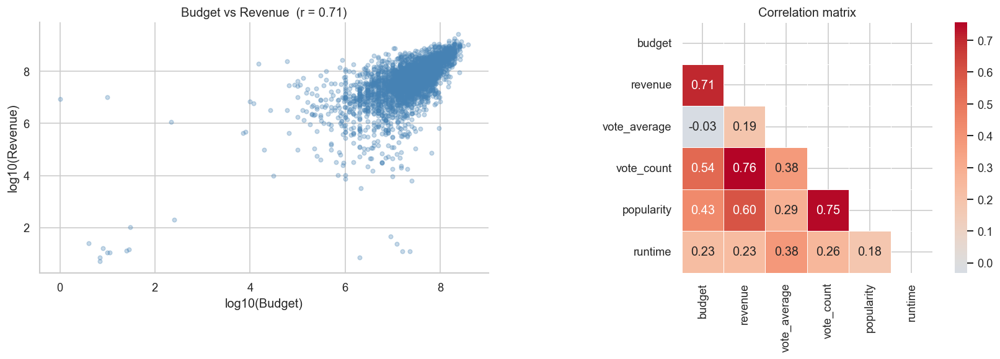
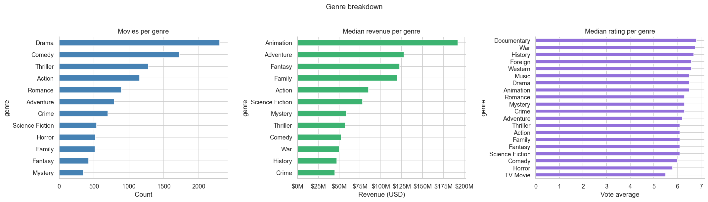
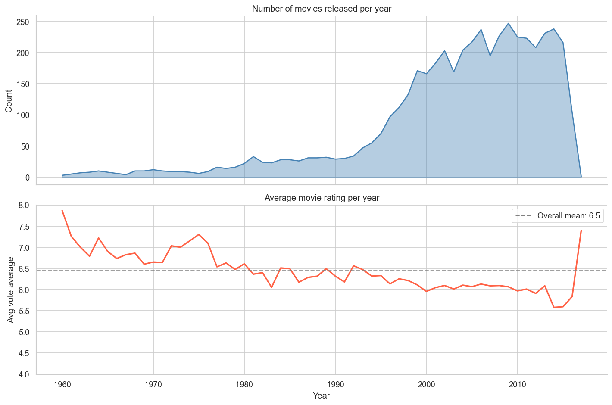

# 🎬 What Makes a Movie Successful?
### Exploratory Data Analysis — TMDB 5000 Movie Dataset

## Project Overview

An end-to-end exploratory data analysis of 5,000 movies from The Movie Database (TMDB), uncovering patterns in budgets, revenues, genres, and audience ratings using Python.

**Key question answered:** Which genres are commercially successful, which are critically acclaimed, and which manage to be both?

---

##  Key Findings

-  **Animation dominates** — highest median revenue (~$200M) while maintaining above-average ratings. The most commercially reliable genre.
-  **Documentaries are critically loved but commercially ignored** — highest median rating (6.8/10) but near-zero revenue. Quality ≠ profit.
-  **Drama is the volume king** — more Drama films than any other genre, but modest revenue suggests an oversaturated market.
-  **Horror scores worst on both axes** — lowest median rating (5.8) and low revenue, making it the highest-risk genre.
-  **Budget and revenue are correlated (r ≈ 0.73)** — spending more increases revenue on average, but high-budget flops are common outliers.
-  **Movie production has grown exponentially since the 1980s**, while average ratings have gradually declined — more films, lower average quality.

---

##  Visualizations

| Chart | Description |
|-------|-------------|
|  | Distribution of ratings, budgets, and runtimes |
|  | Correlation matrix — budget, revenue, popularity, ratings |
|  | Genre breakdown by volume, revenue, and rating |
|  | Movie production and rating trends over time |
|  | Revenue vs Rating bubble chart by genre |

---

##  Tech Stack

| Tool | Purpose |
|------|---------|
| Python 3.14 | Core language |
| Pandas | Data loading, cleaning, transformation |
| NumPy | Numerical operations |
| Matplotlib | Base plotting |
| Seaborn | Statistical visualizations |
| Jupyter Notebook | Interactive analysis environment |

---

##  Dataset

- **Source:** [TMDB 5000 Movie Dataset — Kaggle](https://www.kaggle.com/datasets/tmdb/tmdb-movie-metadata)
- **Size:** 4,803 movies after cleaning
- **Features used:** budget, revenue, genres, release_date, vote_average, vote_count, popularity, runtime

---

##  How to Run

# 1. Clone the repo
git clone https://github.com/sindhurasreddy-del/tmdb-movie-eda.git
cd tmdb-movie-eda

# 2. Install dependencies
pip install pandas numpy matplotlib seaborn jupyter

# 3. Download the dataset from Kaggle and place in the same folder
# https://www.kaggle.com/datasets/tmdb/tmdb-movie-metadata

# 4. Launch the notebook
jupyter notebook tmdb_eda_starter.ipynb

##  Next Steps

- [ ] Build a revenue prediction model using Linear Regression (Phase 2)
- [ ] Analyse cast & director impact on ratings using `tmdb_5000_credits.csv`
- [ ] Deploy an interactive Streamlit dashboard (Phase 4)

---

##  Author

**Sindhura S Reddy**  

[GitHub](https://github.com/sindhurasreddy-del)
